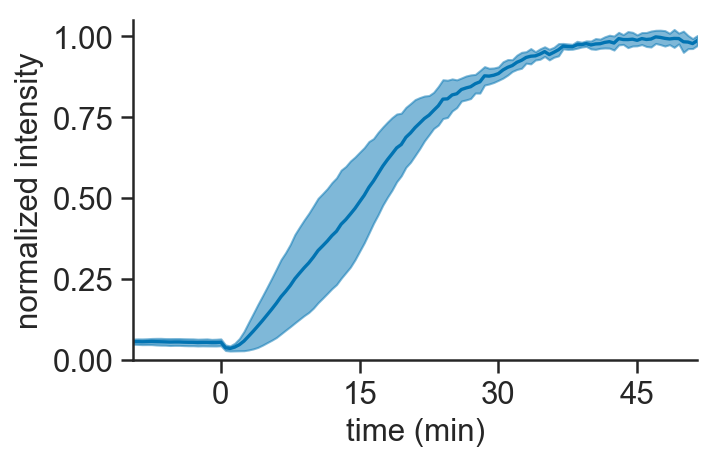
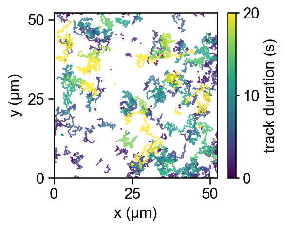
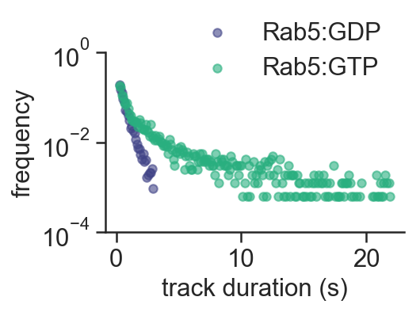

# Plot examples

Here are listed codes for some plot examples in our manuscript [Stochastic activation and bistability in a Rab GTPase regulatory network](https://www.biorxiv.org/content/10.1101/776567v1).

Generally, I combine the [seaborn library](http://seaborn.pydata.org/index.html) with [matplotlib](https://matplotlib.org/) and [pandas](https://pandas.pydata.org/).

I recommend saving the plots as vector .svg graphics and editing them in Adobe Illustrator or open-source [Inkscape](https://inkscape.org/).

In case of any questions, please [email me](mailto:ubezelja@ist.ac.at).

**Note: the figures are not necessary exactly the same as seen in the paper. The examples are meant to present the main formatting features of individual plots.*

## Fig. 1B example
The Figure 1B example will introduce you to a regular line plot with SD error depicted in shaded area.

**>> Fig. 1B Jupyter [notebook](notebooks/Fig_1B_example.ipynb) <<**

## Fig. 3B example (trajectory diagram)
Figure 3B displays a trajectory diagram of 500 random Rab5 single particle trajectories and after (GTP) nucleotide exchange. The trajectories are color-coded for their duration.

**>> Fig. 3B (trajectories) Jupyter [notebook](notebooks/Fig_3B_trajectories_example.ipynb) <<**

## Fig. 3B example (frequency diagram)
Figure 3B displays a frequency scatter diagram of Rab5 membrane lifetimes before (GDP) and after (GTP) nucleotide exchange. This example will introduce you to displaying scattered data points on a log axis and defining the axis tick values.

**>> Fig. 3B Jupyter [notebook](notebooks/Fig._3B_example.ipynb) <<**

# Analyis examples

Here you can find useful data analyis examples:

- Fluorescence intensity readout import
- Gompertz function fitting
- Normalization and averaging